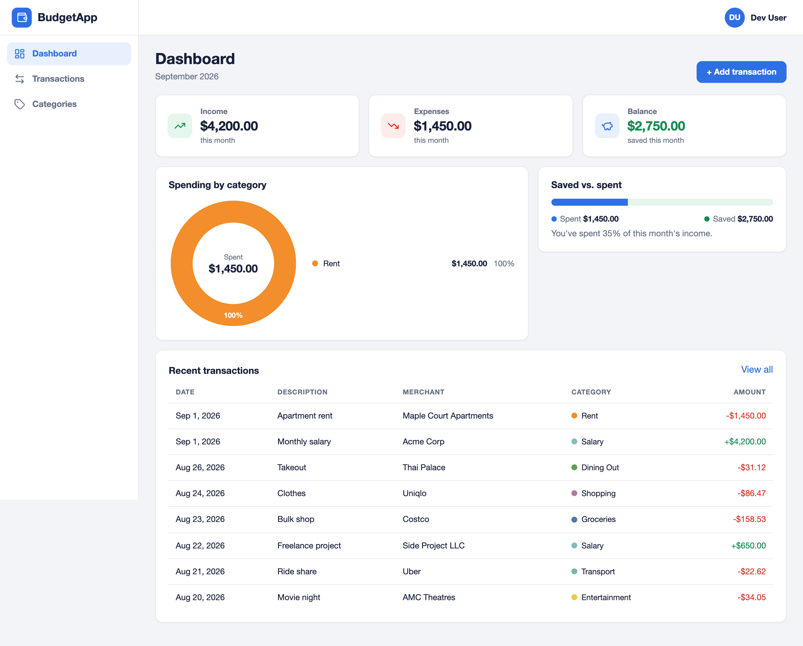
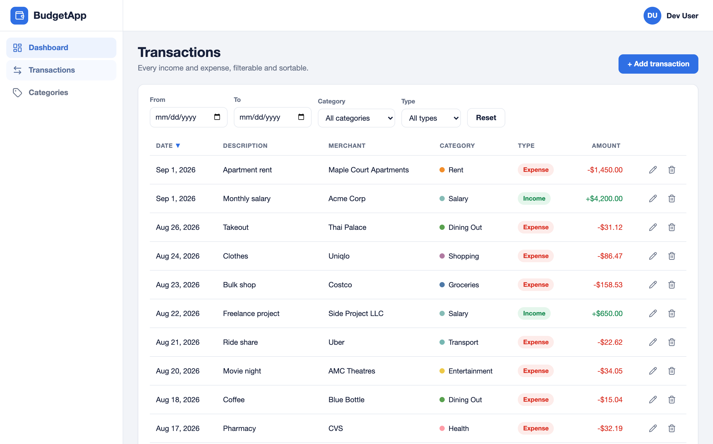
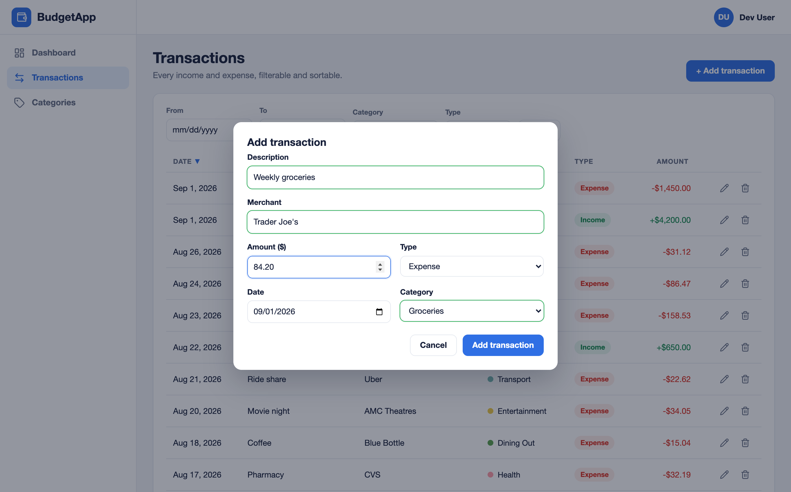
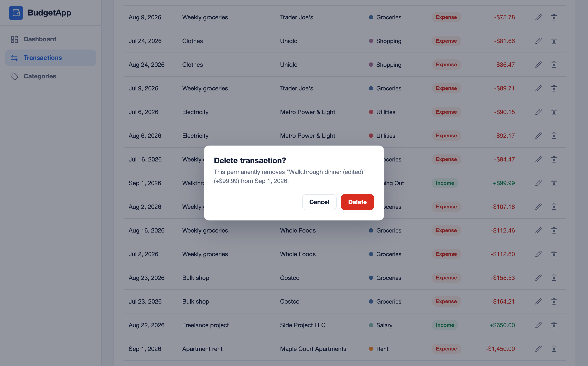
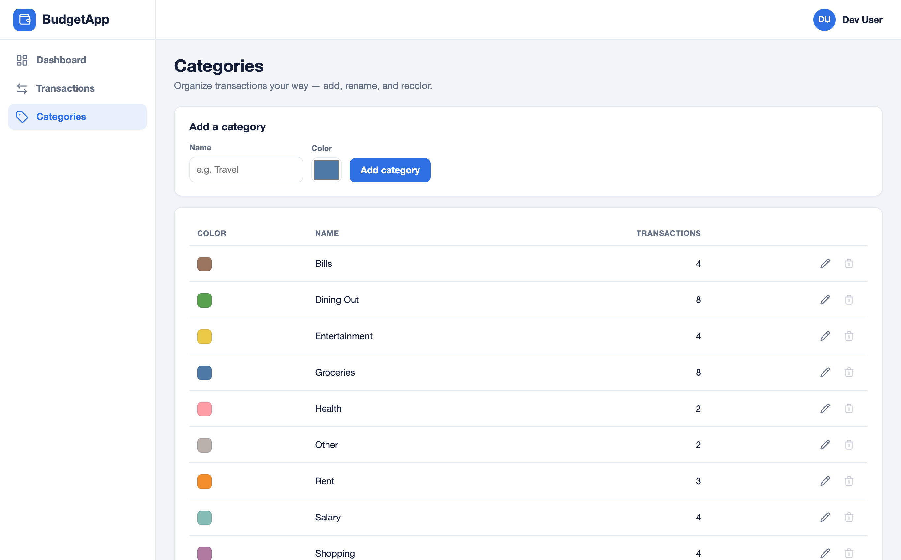
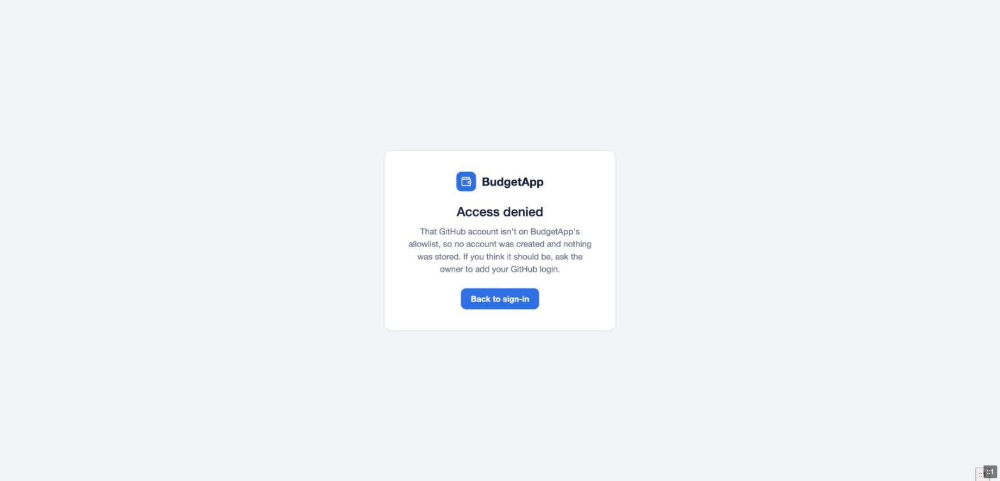
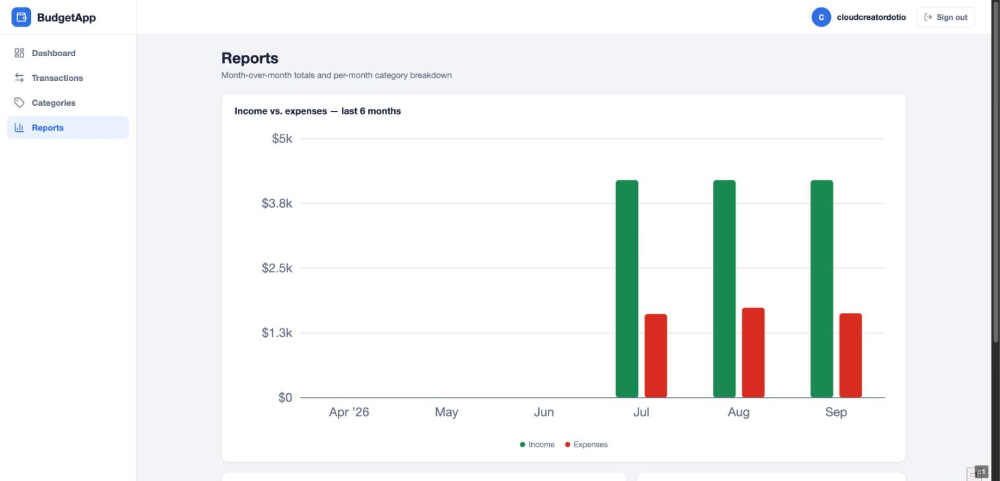
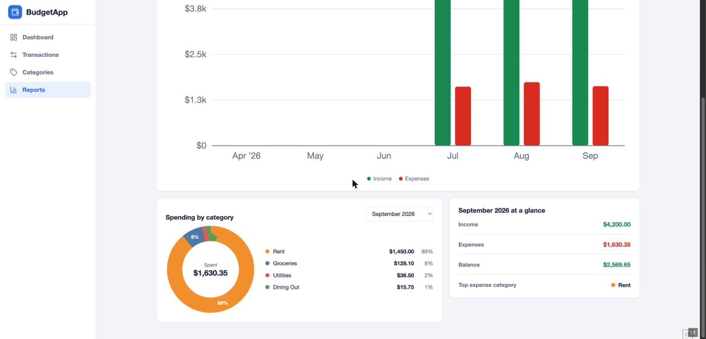

# BudgetApp

A monthly budgeting application: track income and expense transactions, organize them into
per-user categories, and see summaries, saved-vs-spent, and category breakdowns on a dashboard,
plus month-over-month reports. Sign-in is via GitHub OAuth, restricted to an allowlist of
GitHub accounts; every query is scoped to the signed-in user.

Built with ASP.NET Core Blazor (.NET 10, Interactive Server render mode) and EF Core 10 on
SQL Server. Configuration and secrets come from Azure Key Vault in connected environments.
Deployed as a Linux container to Azure App Service behind an nginx reverse proxy and Cloudflare:
**https://budgetapp.cloudcreator.io**.

## Screenshots

| | |
|---|---|
|  |  |
| Dashboard — month stats, saved vs. spent, category donut | Transactions — filter, sort, CRUD |
|  |  |
| Create/edit with validation | Delete confirmation |
|  |  |
| Categories — add, rename, recolor; delete blocked while in use | Non-allowlisted sign-in |
|  |  |
| Reports — income vs. expenses by month | Reports — per-month category donut |

## Architecture

```
Browser ──https──> Cloudflare proxy (budgetapp.example.com, Full strict)
                     │  443 — Origin CA cert; NSG admits only Cloudflare's IP ranges
                     ▼
           nginx on budgetapp-vm-lb-01 (Ubuntu 24.04 B1s, static 10.0.0.10)
                     │  https + SNI, Host: budgetapp-app.azurewebsites.net,
                     │  X-Forwarded-Host/-Proto, websocket upgrade on /_blazor
                     ▼
           Private endpoint 10.0.20.4 (apps subnet)
                     ▼
           App Service budgetapp-app (Linux container from ACR, B1,
           publicNetworkAccess=Disabled, system managed identity)
                     │  regional VNet integration (appsvc subnet, route-all)
         ┌───────────┴───────────┐
         ▼                       ▼
  Azure Key Vault            SQL Server on DB VM
  (private endpoint;         (database BudgetApp; connection string
  config + secrets)          lives in Key Vault)
```

- The web app is reachable **only** through its private endpoint; nginx is the sole public
  entry, and its NSG only admits 80/443 from Cloudflare's published ranges (SSH from the VPN).
- The app's managed identity pulls the image from ACR (`AcrPull`) and reads secrets
  (`Key Vault Secrets User`); there are no registry or vault credentials anywhere.
- Two private DNS zones (`privatelink.vaultcore.azure.net`, `privatelink.azurewebsites.net`)
  make the vault and the app resolve to private IPs inside the VNet.
- nginx serves a **Cloudflare Origin CA** certificate fetched from Key Vault by the VM's own
  managed identity, so a rebuilt VM re-provisions itself without hand-holding.
- Everything is Bicep under `infra/`, driven by the scripts in `deploy/` — nothing is
  portal-configured.

## Running locally

There are two local modes. Both run the app on the host with `dotnet run` from the repository
root; they differ only in where the database and configuration come from.

App URLs: `https://localhost:7017` / `http://localhost:5299`. Health endpoint: `/healthz`.

### Offline mode (Docker SQL Server, no VPN, no Azure)

1. Create the environment file for the database container:

   ```bash
   cp .env.example .env    # then edit .env and choose a strong password
   ```

2. Start SQL Server (first run pulls the image; `--wait` blocks until healthy):

   ```bash
   docker compose up -d --wait db
   ```

   The image is amd64-only. On Apple Silicon, Docker Desktop must use the Apple
   Virtualization framework with **Rosetta enabled** (Settings → General) — under qemu
   emulation SQL Server 2022 crashes on start with a segmentation fault.

3. Point the app at the container and disable Key Vault via user-secrets (replace the
   password with the value from your `.env`):

   ```bash
   dotnet user-secrets set "KeyVault:Uri" "" --project BudgetApp
   dotnet user-secrets set "Database:SeedSampleData" "true" --project BudgetApp
   dotnet user-secrets set "ConnectionStrings:BudgetApp" \
     "Server=localhost,1433;Database=BudgetApp;User Id=sa;Password=<your SQL_SA_PASSWORD>;TrustServerCertificate=True;Encrypt=True" \
     --project BudgetApp
   ```

4. Run the app:

   ```bash
   dotnet run --project BudgetApp --launch-profile https
   ```

   On first start the app creates the database, applies EF Core migrations, and seeds a dev
   user with default categories and three months of sample transactions
   (`Database:SeedSampleData=true` — off everywhere except offline mode).

### GitHub sign-in (both local modes)

Local sign-in uses the **BudgetApp (local)** GitHub OAuth App (callback
`https://localhost:7017/signin-github`). One-time setup:

```bash
# Client id is not a secret — it lives in BudgetApp/appsettings.Development.json.
dotnet user-secrets set "Authentication:GitHub:ClientSecret" "<local OAuth app client secret>" --project BudgetApp
```

**Setting up your own GitHub OAuth App:** create your own GitHub OAuth
App (a minute: GitHub → Settings → Developer settings → OAuth Apps → New):
name it `BudgetApp (local)` (the name is cosmetic — it's what GitHub's authorize screen
shows), homepage `https://localhost:7017`, callback
`https://localhost:7017/signin-github`. Then
point the app at it via user-secrets (they override `appsettings.Development.json`, no
code changes):

```bash
dotnet user-secrets set "Authentication:GitHub:ClientId" "<your client id>" --project BudgetApp
dotnet user-secrets set "Authentication:GitHub:ClientSecret" "<your client secret>" --project BudgetApp
```

If this machine has never run an ASP.NET Core app, also run
`dotnet dev-certs https --trust` once so the browser trusts `https://localhost:7017`.

Only accounts in `Authentication:GitHub:AllowedLogins` (comma-separated, case-insensitive)
can sign in; anyone else lands on `/access-denied` and no user row is created. A user row
plus the default category set is provisioned on first allowed sign-in, keyed by the GitHub
numeric account id. In offline mode that row lives in the local container database; in
connected mode it is created in the real database.

### Connected mode (VPN + Azure Key Vault + real database)

Requirements:

- The point-to-site VPN is connected and `/etc/hosts` maps
  `<your-keyvault-name>.vault.azure.net` to the vault's private endpoint IP.
- `az login` with an identity that has `Key Vault Secrets User` on the vault
  (`DefaultAzureCredential` picks up the Azure CLI session).

Remove the offline overrides so `appsettings.Development.json` (which sets `KeyVault:Uri`)
takes effect again:

```bash
dotnet user-secrets remove "KeyVault:Uri" --project BudgetApp
dotnet user-secrets remove "ConnectionStrings:BudgetApp" --project BudgetApp
dotnet user-secrets remove "Database:SeedSampleData" --project BudgetApp
dotnet run --project BudgetApp --launch-profile https
```

The connection string then comes from the Key Vault secret `ConnectionStrings--BudgetApp`
(the provider maps `--` to `:`). On boot the app logs **which provider and secret name** the
connection string was resolved from — never the value. Sample seeding stays off: connected
mode talks to the real database.

## Container

The multi-stage `Dockerfile` (repo root) publishes the app with the .NET 10 SDK and runs it
on the `aspnet:10.0` runtime image as the non-root `app` user, listening on **8080**. Images
are always built for **linux/amd64** (App Service's architecture — a plain `docker build` on
an Apple Silicon Mac would produce an unusable arm64 image); the build stage cross-compiles,
so it runs at native speed on arm64.

Build and push to Azure Container Registry (tags `<short git sha>` and `latest`; requires
`az login` with push rights — the registry's admin user is disabled):

```bash
./deploy/build-push.sh
```

Run the pushed image locally against the offline database (config comes entirely from
environment variables in `docker-compose.yml` — containers have no user-secrets):

```bash
az acr login --name <your-acr-name>   # not needed right after build-push.sh
docker compose --profile app up -d --wait
curl http://localhost:8080/healthz      # -> Healthy
```

The app is at `http://localhost:8080`. GitHub sign-in is deliberately not configured in this
mode (the local OAuth App's callback points at `https://localhost:7017`, which cannot reach
the container) — the sign-in page renders and `/healthz` works, which is what this mode is
for: proving the ACR artifact runs. Stop it with `docker compose --profile app rm -sf app`
(leaves the database running).

## Deploying to Azure

Everything below is idempotent — re-running a script against an unchanged environment makes
no changes (re-running `deploy-lb.sh` additionally refreshes the NSG's Cloudflare ranges,
which is the supported way to update them).

Prerequisites: Azure CLI logged in with rights to deploy into the resource group and create
role assignments; Docker with buildx. The deploy scripts themselves don't need the VPN;
`install-origin-cert.sh` and any over-the-private-endpoint verification do. App Service
compute quota in the region must allow the B1 plan (a fresh subscription may need a quota
support request first — ours did).

Approximate monthly cost of what these scripts create (East US 2, 2026 prices): App Service
plan B1 ~$13 + private endpoint ~$7 + private DNS zones ~$1 + VM B1s ~$9 + disk ~$2.40 +
public IP ~$3.65 ≈ **$36/month**, on top of the pre-existing registry, SQL VM, and VPN.

### 1. Build and push the image

```bash
./deploy/build-push.sh            # tags <short git sha> + latest; warns on a dirty tree
```

### 2. Platform (subnets, DNS, App Service, private endpoint, roles)

```bash
./deploy/deploy-platform.sh [imageTag]   # default tag comes from infra/main.bicepparam
```

Creates the two subnets, both private DNS zones (+ VNet links and the vault A record), the
B1 plan, the web app (container from ACR via managed identity, VNet-integrated route-all,
`publicNetworkAccess=Disabled`, WebSockets, `/healthz` health check), the `AcrPull` and
`Key Vault Secrets User` role assignments, and the app's private endpoint with auto-registered
DNS. On the first run it waits out AcrPull propagation and restarts the app; re-runs skip that.

Verify over the VPN (the app has no public endpoint):

```bash
curl -s --resolve <app-name>.azurewebsites.net:443:<pe-ip> \
  https://<app-name>.azurewebsites.net/healthz        # -> Healthy
az webapp log tail -g <resource-group> -n <app-name>
```

### 3. Load balancer VM

```bash
./deploy/deploy-lb.sh
```

Fetches Cloudflare's current IPv4/IPv6 ranges (refusing to proceed on a suspicious fetch),
then deploys the static public IP, the NSG (80/443 from Cloudflare only, SSH from the VPN),
the NIC (static 10.0.0.10), and the Ubuntu VM. cloud-init installs nginx configured for the
app: SNI + `Host: <app-name>.azurewebsites.net` upstream, `X-Forwarded-Host/-Proto`,
websocket upgrade + long read timeout on `/_blazor`, HTTP→HTTPS redirect, `CF-Connecting-IP`
real-IP restoration, and a temporary self-signed certificate until the real one exists. The
VM's managed identity gets `Key Vault Secrets User` so it can fetch the origin certificate
itself — deleting and redeploying the VM fully re-provisions it.

### 4. Cloudflare hand-off (manual, in order)

1. In Cloudflare, create an **Origin CA certificate** for `*.yourdomain.com,
   yourdomain.com` and download the PEM certificate and key.
2. Upload it to Key Vault and switch nginx onto it (VPN required):

   ```bash
   ./deploy/install-origin-cert.sh <origin-cert.pem> <origin-key.pem>
   ```

3. Add the proxied (orange-cloud) A record `budgetapp` → the VM's public IP.
4. Zone settings: SSL/TLS **Full (strict)**, **Always Use HTTPS** on, WebSockets on; leave
   Rocket Loader / minification / email obfuscation **off** (they rewrite HTML and break
   Blazor's script and circuit negotiation).

### Verify the public path

```bash
curl -sI https://budgetapp.example.com/healthz   # HTTP/2 200 + a cf-ray header
curl -sI http://budgetapp.example.com/           # 301 to https
```

Then sign in through the browser and confirm the WebSocket circuit connects (the console
logs `WebSocket connected to wss://budgetapp.example.com/_blazor…`). A direct
`https://<public-ip>` from a non-Cloudflare address is refused by the NSG — that's intended.

### Routine operations

- **Ship a new app version:** `./deploy/build-push.sh` then
  `./deploy/deploy-platform.sh <newTag>` (the site config change recycles the container).
- **Refresh Cloudflare IP ranges in the NSG:** re-run `./deploy/deploy-lb.sh`; nginx's own
  real-IP list refreshes on VM boot. Never hand-edit the NSG rule.
- **Rotate the origin certificate:** re-run `./deploy/install-origin-cert.sh` with new PEMs.
- **Rebuild the LB VM:** delete the VM and re-run `./deploy/deploy-lb.sh` — cloud-init plus
  the vault-fetched certificate restore it completely.

## Database and migrations

- EF Core code-first migrations live in `BudgetApp/Migrations/` and are applied
  automatically at startup while `Database:MigrateOnStartup` is `true` (the default).
  The app never calls `EnsureCreated`.
- Add a migration (uses the local `dotnet-ef` tool and a design-time factory — no
  database or Key Vault access needed):

  ```bash
  dotnet tool restore
  dotnet ef migrations add <Name> --project BudgetApp
  ```

- Data-protection keys are persisted to the database (`DataProtectionKeys` table) so
  container restarts don't invalidate cookies.

## Configuration model

| Key | Purpose | Default |
|---|---|---|
| `KeyVault:Uri` | Non-empty enables the Key Vault configuration provider | empty (offline); vault URI in `appsettings.Development.json` |
| `ConnectionStrings:BudgetApp` | SQL Server connection string | from Key Vault, or user-secrets offline |
| `Database:MigrateOnStartup` | Apply migrations at startup | `true` |
| `Database:SeedSampleData` | Seed dev user + sample data (offline only) | `false` |
| `Authentication:GitHub:ClientId` | OAuth App client id (per environment) | `appsettings.Development.json` locally; app setting in Azure |
| `Authentication:GitHub:ClientSecret` | OAuth App client secret | user-secrets locally; Key Vault (`Authentication--GitHub--ClientSecret`) in Azure |
| `Authentication:GitHub:AllowedLogins` | GitHub logins allowed to sign in (comma-separated, case-insensitive) | allowed accounts (see `appsettings.json`) |
| `ForwardedHeaders:KnownProxies` | Trusted reverse-proxy IPs for `X-Forwarded-*` | unset (middleware trusts only loopback → local no-op) |
| `ForwardedHeaders:KnownNetworks` | Trusted proxy CIDRs — in Azure `169.254.0.0/16,10.0.0.0/16` (App Service frontend + VNet) | unset |
| `ForwardedHeaders:ForwardLimit` | Max proxy hops to unwind (frontend → PE NAT → nginx → client) | unset (`1`); `4` in Azure |

Secrets never live in `appsettings*.json`, `.env` is gitignored, and local secrets belong in
`dotnet user-secrets`. In Development, user-secrets are re-added **after** Key Vault so local
overrides win over vault values (otherwise the vault's production OAuth secret would
silently override the local OAuth App's secret and GitHub would reject the callback).

## Design decisions and tradeoffs

- **Blazor Interactive Server, no API project.** One deployable, no client bundle, C#
  end-to-end. Tradeoff: every user holds a WebSocket circuit, so the whole proxy chain
  (Cloudflare → nginx → App Service) must pass WebSockets, and scale-out would need sticky
  sessions. Fine at this size.
- **Migrations apply at startup.** Zero-step deploys; the tradeoff is that it's only safe
  while a single instance runs (two instances migrating concurrently could race). Documented
  here deliberately — scale-out needs a different migration story first.
- **Hand-rolled SVG charts** (donut, grouped bars) instead of a charting library: no JS
  interop, nothing for a proxy or Cloudflare feature to mangle, works offline. Tradeoff:
  fancier chart types would be manual work.
- **No CSS framework.** The app ships one hand-written `app.css` (plus a tiny reset); the
  Bootstrap payload the Blazor template carries was removed. Tradeoff: no utility classes —
  new UI means writing CSS.
- **Allowlist enforced in `OnTicketReceived`, not `OnCreatingTicket`.** The OAuth handler
  ignores a `Fail()` from `OnCreatingTicket` and issues the cookie anyway; `OnTicketReceived`
  runs before `SignInAsync`, so rejection there truly prevents both cookie and user row. A
  cookie-validation event additionally signs out any cookie missing the internal user-id
  claim (defense in depth).
- **Per-user isolation in the service layer.** Every query goes through user-scoped services
  reading the id from a claim stamped at sign-in; components never touch the `DbContext`
  (and Blazor Server mandates `IDbContextFactory` anyway).
- **Money is `decimal(18,2)`, always positive, with an income/expense type column**; dates
  are `DateOnly`/SQL `date`. No floats, no times to get wrong across zones.
- **Private-only App Service.** The app has no public endpoint at all; the only ways in are
  the private endpoint (VPN/VNet) and Cloudflare → nginx. Tradeoff: debugging needs the VPN
  (Kudu over the private endpoint accepts ARM bearer tokens).
- **Cloudflare Origin CA instead of Let's Encrypt** on nginx: 15-year validity, no renewal
  automation, and the NSG only admits Cloudflare anyway — nothing else ever sees the cert.
  Tradeoff: the origin is unreachable by browsers directly (by design), and `curl` to the
  origin needs `-k` or the Cloudflare CA bundle.
- **Managed identities everywhere.** ACR pull, Key Vault reads (app + LB VM) — no passwords
  or connection secrets outside the vault; the registry's admin user stays disabled.
- **Forwarded headers trust `KnownNetworks`, not just a proxy IP.** Inside App Service the
  container's TCP peer is the platform frontend (link-local 169.254.x), never nginx itself,
  so trusting `10.0.0.10` alone would silently ignore every `X-Forwarded-*` header and break
  OAuth redirect URIs.
- **Cloudflare IP ranges are always fetched live** (deploy script for the NSG, boot script
  for nginx real-IP) and the Bicep parameters have no defaults, so a stale hand-edited range
  list can't ship.

## Assumptions

- The pre-existing infrastructure is in place and healthy: virtual network (with free space
  for the two new subnets), Azure Key Vault with its private endpoint, SQL Server VM with
  a `BudgetApp` database whose owner login is in the vault connection string, container
  registry, point-to-site VPN, and domain on Cloudflare.
- Single region (East US 2), single App Service instance, single-digit user count — sizing,
  migrate-on-startup, and the B1/B1s SKUs all assume this.
- The Cloudflare free plan's proxy features are sufficient (they are: proxying, Origin CA,
  Full strict, WebSockets).
- GitHub is the identity provider for everyone who will ever sign in, and the allowlist app
  setting is the admission mechanism; there is no in-app user management.
- The database NSG admits SQL traffic from within the VNet (verified — the delegated subnet
  reaches 1433 under the existing `VirtualNetwork` rules).

## Tests

```bash
dotnet test
```

`BudgetApp.Tests` (xunit) covers the sign-in allowlist, the claims → current-user mapping,
and summary/formatting math.

## Repository layout

```
README.md             this file
BudgetApp.sln
BudgetApp/            the app (+ Screenshots/)
BudgetApp.Tests/      xunit tests
infra/                Bicep — main.bicep (platform), lb.bicep (edge VM), modules/
deploy/               build-push.sh, deploy-platform.sh, deploy-lb.sh,
                      install-origin-cert.sh, cloud-init.yaml
docker-compose.yml    offline SQL Server (+ optional ACR-image app profile)
Dockerfile            multi-stage amd64 container build
```
